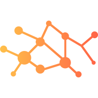

  

<h3 align="center">
Hi there, I'm Kevin 👋
</h3>

<h2 align="center">
Biomedical Data Scientist 🧬, NSF GRFP Fellow 💻, Statistics PhD Student 📈
</h2>

- 👀 I’m interested in data science, computational statistics, and machine learning, as well as their applications to medicine, imaging, and engineering.
- 💞️ My thesis projects thus far have revolved around decision trees and their extensions, and how these methods can be modified to better model complex data.
- 🌱 I’m currently working on an Rcpp package that improves Bayesian tree-based ensemble models in the presence of measurement error.
- 📫 You can reach me by emailing me at <kevin@kmccoy.net>

# My Repositories

### Reproductions of Standard ML Algorithms

- [Neural Network From Scratch (No PyTorch!)](https://github.com/kmccoy3/km-net)
- [Decision Trees with Customizable Cost Functions](https://github.com/kmccoy3/km-cart)
- [EM Algorithm for Gaussian Mixture Models](https://github.com/kmccoy3/kevinRpkg)

### Repos Associated with Published Papers

- ["Weighted sum-of-trees model for clustered data", McCoy et al. 2025](https://github.com/kmccoy3/weighted-trees)

### Standalone Projects

- [An Exploration of Bayesian Quantile Regression and Comparison to Other Methods](https://github.com/kmccoy3/bayesian-qr)
- [Extension of John Tukey's 'Mathematics and the Picturing of Data' into Three Dimensions](https://github.com/kmccoy3/3D-DataReduction-DataVis)

### Useful Templates

- [Rice University LaTeX/Beamer Presention Template](https://github.com/kmccoy3/rice-presentation-template)
- [Rice University LaTeX Poster Template](https://github.com/kmccoy3/rice-poster-template)

### Class Notes + Starter Code

- [Computer Vision Notes](https://github.com/kmccoy3/cv_notes)
- [Reinforcement Learning Notes](https://github.com/kmccoy3/rl_notes)

# Connect with me

 
 

